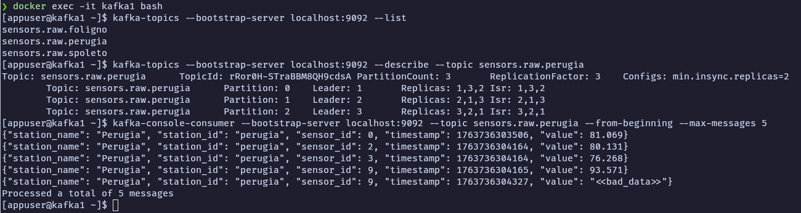
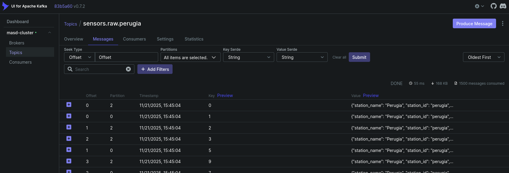
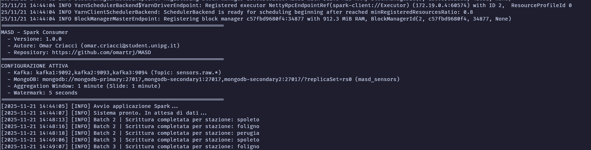
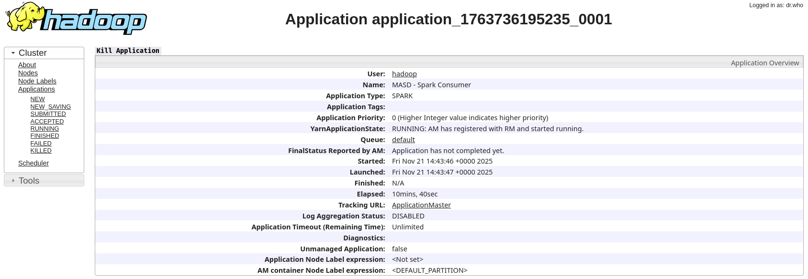
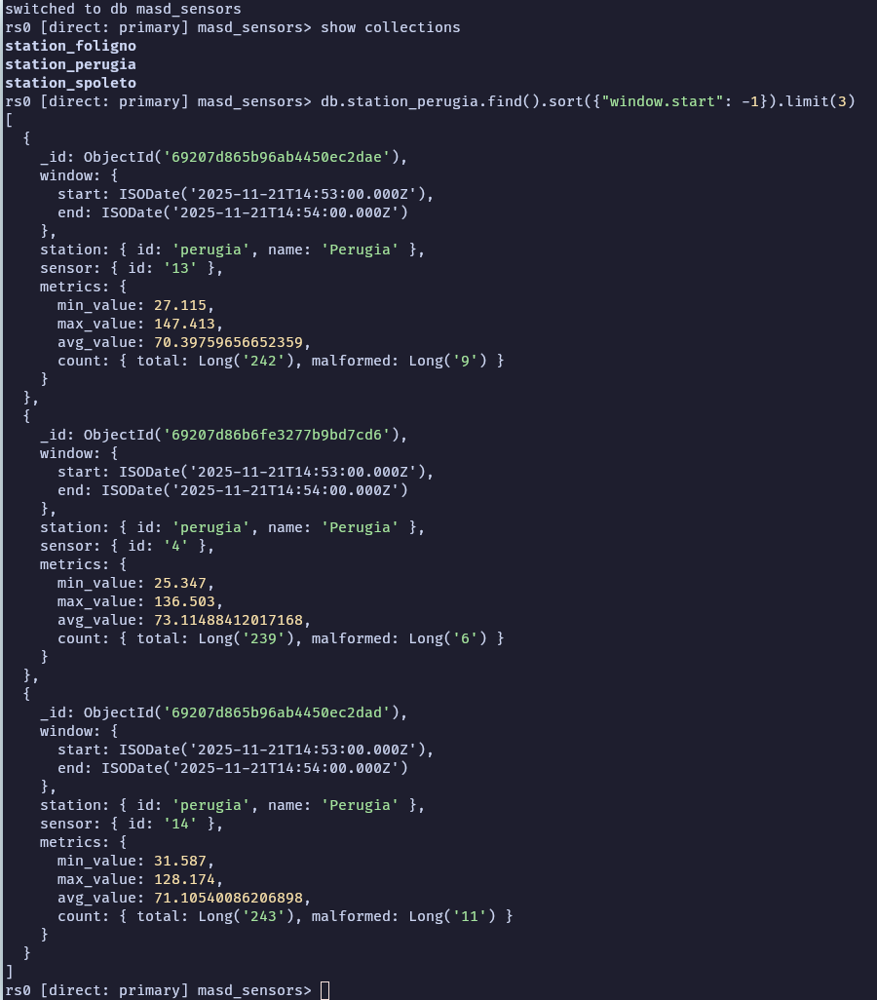
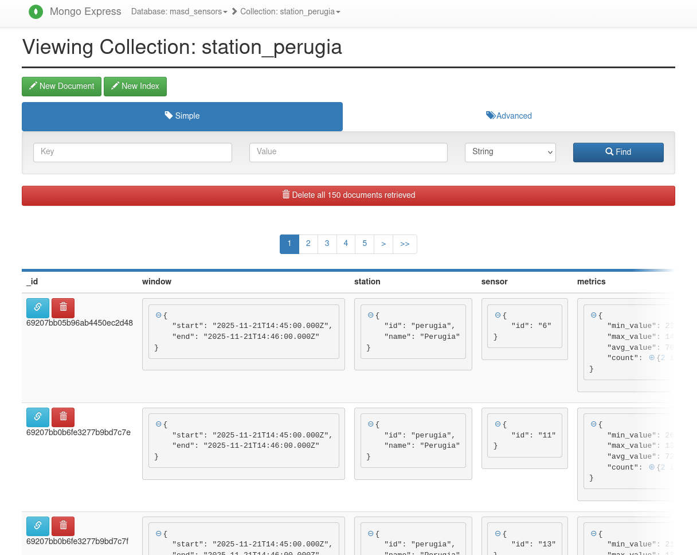

# Usage Flow

This document describes the end-to-end flow of data in the MASD pipeline, from generation to storage, including how to verify each step.
For this particular example, i ran the stack with both the Kafka and MongoDB web UIs enabled, and with a Hadoop cluster scaled to 2 datanodes and 2 nodemanagers:

```bash
docker compose --profile web-ui up -d --build --scale hdfs-datanode=2 --scale yarn-nodemanager=2
``` 

Using the default simulator configuration in `simulator/config.json`, which defines 3 stations (`perugia`, `spoleto` and `foligno`).

## 1. Data Generation (Simulator)

The **Simulator** (`simulator/producer.py`) acts as a generic sensors station. It generates synthetic data and publishes it to Kafka.

The simulator generates JSON messages. The validity of the message is determined by the `value` field:

**1. Valid Data**
`value` is a number.
```json
{
  "station_name": "Perugia",
  "station_id": "perugia",
  "sensor_id": 1,
  "timestamp": 1700000000000,
  "value": 42.5
}
```

**2. Malformed Data**
`value` is a string (e.g., `"<<bad_data>>"`). Injected intentionally based on `malformation_pct` in `config.json` to test Spark's error handling.
```json
{
  "station_name": "Perugia",
  "station_id": "perugia",
  "sensor_id": 1,
  "timestamp": 1700000000000,
  "value": "<<bad_data>>"
}
```

---

## 2. 📬 Ingestion (Kafka)

Data is published to Kafka topics named `sensors.raw.<station_id>` (e.g., `sensors.raw.perugia`).

### Verification

To verify that data is being published correctly, you can use either the command line or the Kafka UI.

**Option A: Command Line (Interactive)**

1.  **Access the container shell:**
    ```bash
    docker exec -it kafka1 bash
    ```

2.  **List all topics:**
    Verify that topics have been created for each station.
    ```bash
    kafka-topics --bootstrap-server localhost:9092 --list
    ```

3.  **Describe a specific topic:**
    Check partition count and replication details.
    ```bash
    kafka-topics --bootstrap-server localhost:9092 --describe --topic sensors.raw.perugia
    ```

4.  **Consume messages:**
    Read the actual data flowing into the topic.
    ```bash
    kafka-console-consumer --bootstrap-server localhost:9092 --topic sensors.raw.perugia --from-beginning --max-messages 5
    ```
    

**Option B: Kafka UI**

1.  Open [http://localhost:8080](http://localhost:8080).
2.  Navigate to **Topics**.
3.  Select a topic (e.g., `sensors.raw.perugia`).
4.  Go to the **Messages** tab to see real-time data.



---

## 3. ✨ Processing (Spark)

The **Spark Application** (`spark-app/consumer.py`) consumes data from Kafka, validates it, and performs windowed aggregations.

### Logic
1.  **Ingest**: Reads from all `sensors.raw.*` topics.
2.  **Parse & Validate**: Converts JSON to a structured schema. Infers validity by checking if `value` is numeric.
3.  **Aggregate**: Groups data into **1-minute tumbling windows**.
    -   Calculates: `min_val`, `max_val`, `avg_val`, `total_count`, and `malformed_count`.

### Verification

**Check Logs**
View the logs of the Spark application to see batch processing status:
```bash
docker logs -f spark-app
```
*Look for messages like: `Batch 2 | Scrittura completata per stazione: perugia`.*

**Note:** It may take a few minutes for the first batches to be processed, depending on when the simulator started sending data, when the Spark app started consuming it, and the defined window aggregation parameters. With the current setup (250ms mean interval, 1-minute windows), you should start seeing output after about 1-2 minutes.



**YARN ResourceManager**
Open [http://localhost:8088](http://localhost:8088) to see the running Spark application (`MASD - Spark Consumer`) and its resource usage.



---

## 4. 💾 Storage (MongoDB)

Aggregated results are saved to MongoDB in the `masd_sensors` database. Each station has its own collection named `station_<station_id>` (e.g., `station_perugia`).

### Data Format
The stored documents contain the statistics for each window in a nested structure:
```json
{
  "window": {
    "start": "2023-11-20T10:00:00.000Z",
    "end": "2023-11-20T10:01:00.000Z"
  },
  "station": {
    "id": "perugia",
    "name": "Perugia"
  },
  "sensor": {
    "id": "1"
  },
  "metrics": {
    "min_value": 40.1,
    "max_value": 45.2,
    "avg_value": 42.5,
    "count": {
      "total": 60,
      "malformed": 3
    }
  }
}
```

### Verification

**Option A: Command Line (Mongosh)**

Use the MongoDB Shell (`mongosh`) to interactively explore the data.

1.  **Access the MongoDB Shell:**
    ```bash
    docker exec -it mongodb-primary mongosh
    ```

2.  **Show Databases:**
    Verify that `masd_sensors` exists.
    ```javascript
    show dbs
    ```

3.  **Switch to the database:**
    ```javascript
    use masd_sensors
    ```

4.  **Show Collections:**
    You should see one collection per station (e.g., `station_perugia`).
    ```javascript
    show collections
    ```

5.  **Query Aggregated Data:**
    Retrieve the most recent aggregations for a station.
    ```javascript
    db.station_perugia.find().sort({"window.start": -1}).limit(3)
    ```
    

**Option B: Mongo Express**

1.  Open [http://localhost:8081](http://localhost:8081).
2.  Click on the `masd_sensors` database.
3.  Select a collection (e.g., `station_perugia`) to view the documents.


